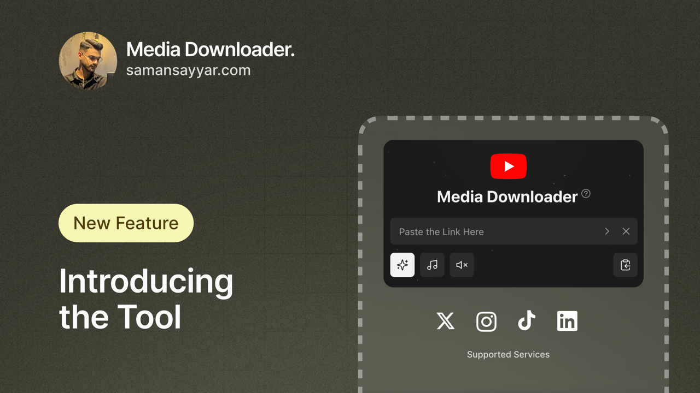

# 🚀 Media Downloader

A powerful and user-friendly media downloader for various social media platforms. Download your favorite content with ease! 😎

## ✨ Features

- 🌐 Support for multiple platforms (YouTube, Facebook, Instagram, TikTok, Twitter, and more!)
- 🎥 High-quality video and audio downloads
- ⚙️ Customizable download settings
- 📱 Responsive and intuitive user interface
- 🌙 Dark mode support for late-night browsing

## 🛠️ Tech Stack

- ⚛️ Next.js
- 🔷 TypeScript
- 🎨 Tailwind CSS
- 🗃️ Zustand for state management
- ✅ Zod for schema validation
- 🎭 Framer Motion for smooth animations

## 🚀 Getting Started

1. Clone the repository
2. Install dependencies: `npm install`
3. Run the development server: `npm run dev`
4. Open [http://localhost:3000](http://localhost:3000) in your browser

## 🤝 Contributing

We love contributions! 💖 Please read our [Contributing Guide](CONTRIBUTING.md) for more information on how to get started.

## 📣 Support Us

If this project helps you, consider giving it a ⭐️! With enough support, we plan to open-source the backend as well, allowing for even more community-driven development and features. Together, we can make Media Downloader even better! 🚀

## 📄 License

This project is licensed under the MIT License - see the [LICENSE](LICENSE) file for details.

---

Happy downloading! 🎉 If you have any questions or suggestions, feel free to open an issue or reach out to us. Let's make media downloading a breeze together! 💪
